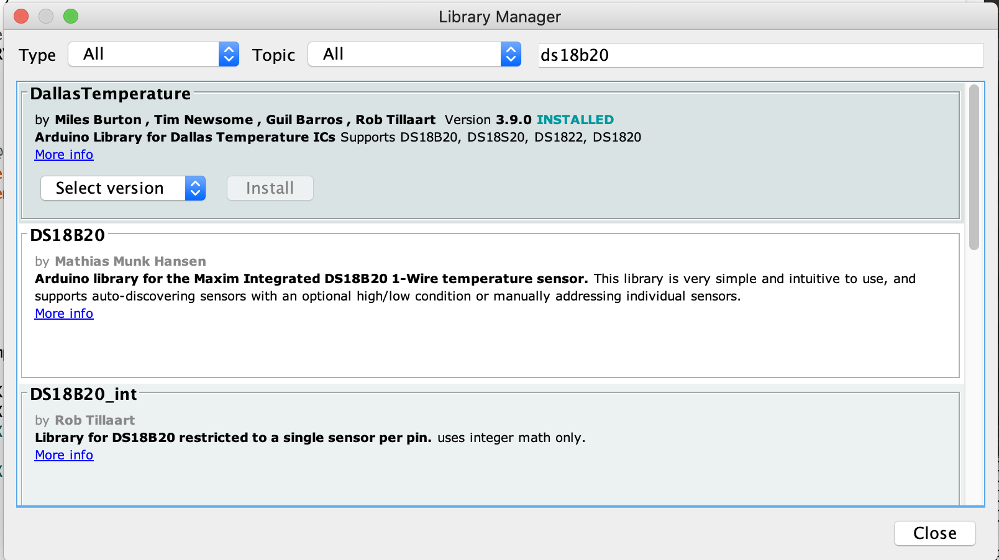

# ESP8266 Zabbix Temperature sensor

## ------- Setting up your ESP SIDE -------
### 1) First make sure everything is ready for ESP8266
Try some tutorials like this:  
https://randomnerdtutorials.com/how-to-install-esp8266-board-arduino-ide/

### 2) Install missing Arduino libraries
Sketch -> Include Library -> Manage Libraries...  

### 3) Set your WiFi and Zabbix information

ZABBIXAGHOST is ...
ZABBIX_KEY is ...

## ------- Setting up your Zabbix SIDE -------

## Credits
Zabbix sender library [zaphodus](https://github.com/zaphodus/ESP8266ZabbixSender)  
Helping configure Zabbix [Eimantas Rebzdys](https://github.com/EimantasRebzdys)
